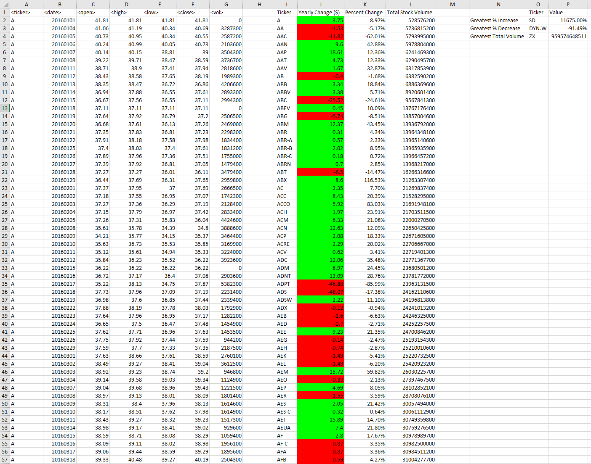

# VBA Multiple Year Stock Data Analysis

## Files in the Repository
The Repository contains the [vba script](./vba-challenge.bas) and two folders:

* [Images](./Images) - This folder contains screenshots of the results that you receive when you run the script.

* [Sample Data](./SampleData) - This folder contains sample files used to develop the script.

## Using the Script
To use the script, simply import it into an Excel workbook that contains at least one sheet with annual stock data and run it.

## Output
The vba script runs on an Excel spreadsheet with multiple sheets and outputs:
 
* The ticker symbol.

* Yearly change from opening price at the beginning of a given year to the closing price at the end of that year. 

* The percent change from opening price at the beginning of a given year to the closing price at the end of that year.

* The total stock volume of the stock.

## Features
  
* Positive yearly changes are highlighted in green and negative yearly changes are highlighted in red. 

* If a ticker has an Open Price of 0, a message box appears showing the cell location of the 0 so it can be edited.

* Screen Updating and Calculation on sheets are suspended until the script completes to improve efficiency and run time. 

* When the script completes, the user will be prompted with a message box that says "Completed."

## Screenshots 
Below you can see examples of the results the script will return. These results are from a file with data from 2014, 2015, and 2016.

### 2014 Results

### 2015 Results

### 2016 Results

## Status
_finished_

## Inspiration
This project was assigned as part of the UTSA Data BootCamp.
 
 
