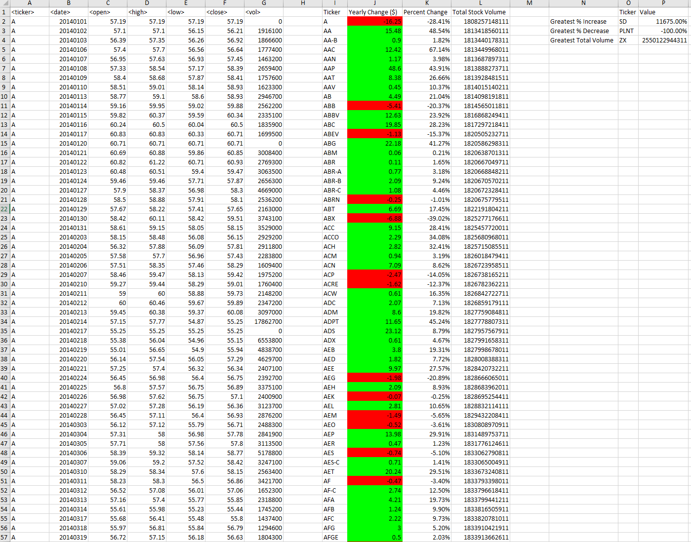

# VBA-challenge - Multiple Year Stock Data Analysis
The vba script runs on an Excel spreadsheet with multiple sheets and outputs:
 
* The ticker symbol.

* Yearly change from opening price at the beginning of a given year to the closing price at the end of that year. 

* The percent change from opening price at the beginning of a given year to the closing price at the end of that year.

* The total stock volume of the stock.
  
Positive yearly changes are highlighted in green and negative yearly changes are highlighted in red. Below you can see examples of the results the script will return. These results are from a file with data from 2014, 2015, and 2016.
 
## 2014 Results

## 2015 Results

## 2016 Results

## Files in the Repository
 
 